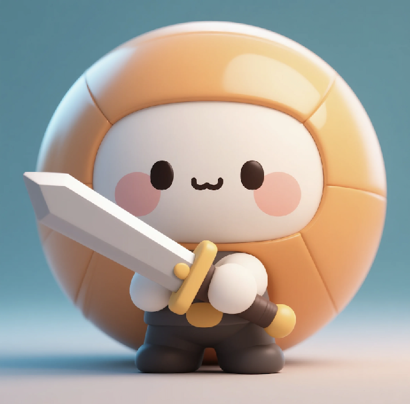

# Battle.meme

Battle.meme is a browser-based 2D multiplayer sword-fighting game centered on fast-paced combat and resource collection, featuring meme-inspired visuals and social interactions.


Visit our official website：https://www.battlememe.fun
Twitter：https://x.com/BattleMemePUMP


## Features

- Real-time multiplayer sword combat
- Resource collection and leaderboard system
- Meme-themed character customization
- Social features for player interaction
- Simple, intuitive controls for broad accessibility

## Technical Architecture

### Frontend
- React.js for dynamic UI rendering
- HTML5 Canvas for 2D game graphics
- Socket.IO client for real-time communication
- Three.js for 3D asset previews
- Fabric.js for the meme editor

### Backend
- Node.js server with Socket.IO for real-time gameplay
- MongoDB for game data storage
- Redis for caching and leaderboards
- IPFS for storing meme content

### Infrastructure
- AWS for scalable cloud hosting
- Cloudflare CDN for static assets
- Auto-scaling support for high concurrency

## Getting Started

### Prerequisites
- Node.js (v16 or higher)
- MongoDB
- Redis

### Installation

1. Clone the repository:
```bash
git clone https://github.com/BattleMeMe3/battle-meme.git
cd battle-meme
```

2. Install dependencies:
```bash
npm install
```

3. Configure environment variables:
```bash
cp .env.example .env
# Edit .env with your configuration
```

4. Start the development server:
```bash
npm run dev
```

5. Open http://localhost:3000 in your browser

## Development

### Project Structure
```
├── client/             # Frontend React application
│   ├── src/
│   ├── public/
│   └── package.json
├── server/             # Backend Node.js server
│   ├── src/
│   ├── config/
│   └── package.json
├── shared/             # Shared types and utilities
└── package.json
```

### Key Components
- Game Engine: Handles physics, combat, and resource collection
- Meme Editor: Custom editor for creating and sharing memes
- Matchmaking System: Pairs players for balanced gameplay
- Leaderboard: Real-time ranking system

## Deployment

### Production Setup
1. Build the application:
```bash
npm run build
```

2. Start the production server:
```bash
npm start
```

### Docker Deployment
1. Build the Docker image:
```bash
docker build -t battle-meme .
```

2. Run the container:
```bash
docker run -p 3000:3000 battle-meme
```

## Contributing

1. Fork the repository
2. Create your feature branch: `git checkout -b feature/amazing-feature`
3. Commit your changes: `git commit -m 'Add amazing feature'`
4. Push to the branch: `git push origin feature/amazing-feature`
5. Open a Pull Request

## License

This project is licensed under the MIT License - see the [LICENSE](LICENSE) file for details.

## Acknowledgments

- Game engine inspired by classic 2D fighting games
- Community contributions to meme content
- Open source gaming frameworks and libraries
